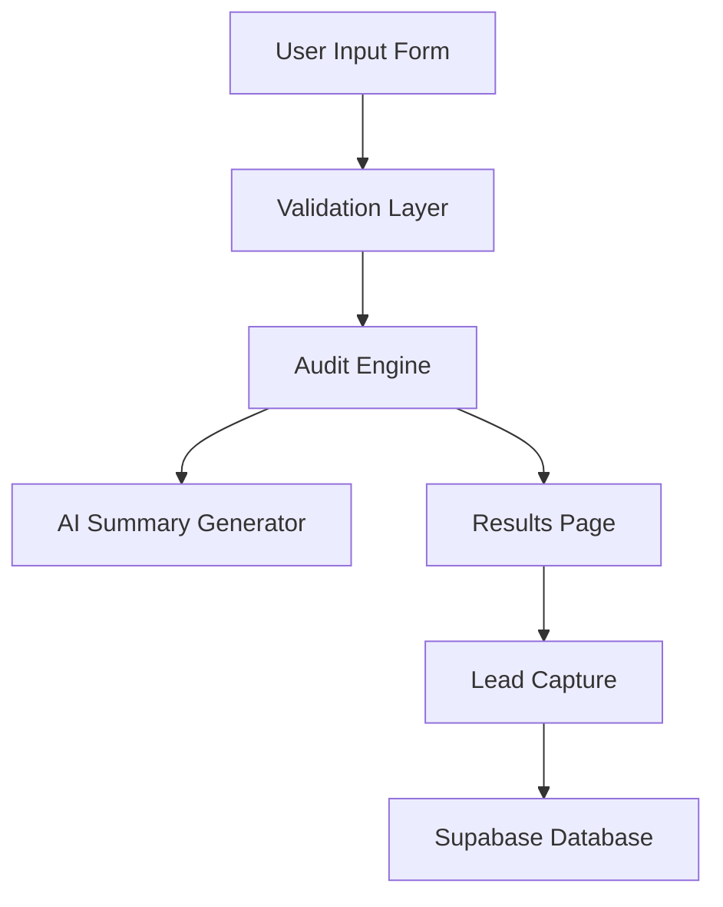

# Architecture

## Planned System Flow

## Notes

- Zustand will manage persistent client-side form state
- Audit calculations will use deterministic rule-based logic
- AI will only generate personalized summaries
- Supabase will store captured leads and audit reports