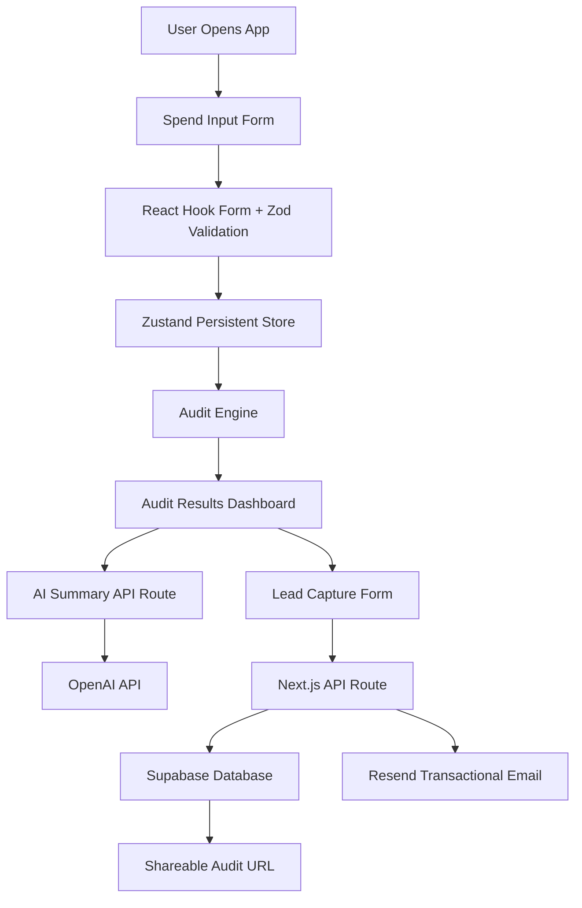

# Architecture Overview

## System Architecture



---

# Data Flow

## 1. User Input Collection

Users enter:

* AI tools
* plans
* monthly spend
* seats
* team size
* primary use case

The form is managed using React Hook Form with Zod schema validation.

Form state is persisted locally using Zustand so partially completed audits survive browser refreshes.

---

## 2. Audit Engine

The audit engine uses deterministic business rules rather than AI-generated financial recommendations.

Each tool submission is evaluated against:

* team size
* plan fit
* potential downgrades
* lower-cost alternatives
* estimated monthly savings

This logic is intentionally explainable and testable.

---

## 3. Results Generation

The audit results page calculates:

* per-tool savings
* total monthly savings
* annualized savings
* optimization recommendations

For high-savings audits, the UI prominently surfaces Credex consultation opportunities.

---

## 4. AI Summary Generation

A Next.js API route sends audit results to the OpenAI API to generate a personalized summary paragraph.

If the API fails or quota limits are reached, the application falls back to a deterministic templated summary to preserve user experience reliability.

---

## 5. Lead Capture + Persistence

Lead capture data is submitted through secure API routes instead of directly from the frontend.

The backend:

* stores leads in Supabase
* sends confirmation emails using Resend
* applies honeypot spam protection

---

## 6. Shareable Audit URLs

Audit results are stored in Supabase and exposed through dynamic routes:

```txt id="r1w8pt"
/audit/[id]
```

Public audit pages intentionally exclude:

* email addresses
* company names
* sensitive identifying details

This enables viral sharing while protecting user privacy.

---

# Why I Chose This Stack

## Next.js

Next.js provided:

* server-side API routes
* App Router support
* production deployment simplicity
* strong TypeScript support
* seamless Vercel deployment

It allowed both frontend and backend functionality to live in a single deployable application.

---

## TypeScript

TypeScript improved:

* type safety
* audit engine reliability
* API contract consistency
* form validation accuracy

Strong typing was especially valuable for financial recommendation logic.

---

## Zustand

Zustand was selected for lightweight persistent state management without Redux-level complexity.

The project only required localized persistent audit state, making Zustand an appropriate tradeoff.

---

## Supabase

Supabase accelerated backend implementation by providing:

* hosted Postgres
* simple SDK integration
* managed infrastructure
* production-ready persistence

This reduced operational complexity during MVP development.

---

# Scaling Considerations (10k Audits/Day)

If this product scaled significantly, I would make several architectural changes:

## 1. Move Audit Engine Into Dedicated Services

The recommendation engine would move into isolated backend services to improve scalability and testing independence.

---

## 2. Add Rate Limiting + Queueing

API routes handling AI summary generation and emails would require:

* proper rate limiting
* request queueing
* retry handling

to avoid provider bottlenecks.

---

## 3. Cache Pricing Data

Pricing structures would move into:

* scheduled sync jobs
* cached configuration tables
* versioned pricing snapshots

instead of static files.

---

## 4. Add Analytics Instrumentation

I would instrument:

* audit completion funnels
* conversion tracking
* share rates
* lead quality metrics

to improve GTM optimization.

---

## 5. Introduce Background Jobs

Email delivery and AI summary generation could move into asynchronous background jobs for improved responsiveness under heavy traffic.
