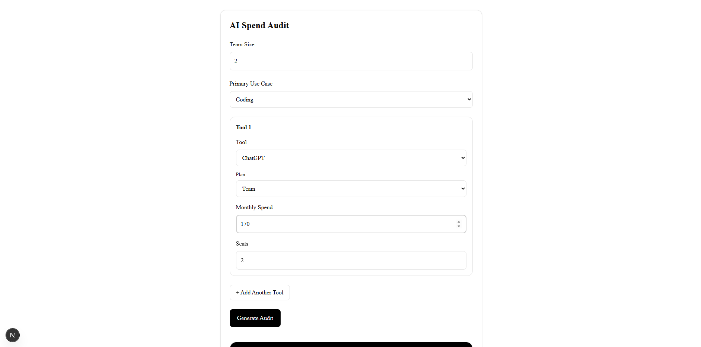

# SpendScope AI

SpendScope AI is a free AI infrastructure cost audit tool built for startup founders and engineering teams. Users can input their current AI tooling stack, receive instant cost optimization recommendations, and estimate potential monthly and annual savings across tools like ChatGPT, Claude, Cursor, GitHub Copilot, Gemini, and others.

The product is designed as both a genuinely useful financial optimization tool and a lead-generation asset for Credex by surfacing real overspending opportunities in AI infrastructure spending.

## Live Application

Deployed URL: [https://spendscope-ai-ebon.vercel.app/]

## Screenshots / Demo

### Landing + Spend Input Form



### Audit Results Dashboard


### Shareable Public Audit URL


Optional screen recording:
(Add Loom or YouTube link here)

---

## Features

* Multi-tool AI spend audit form
* Persistent form state across refreshes
* Dynamic plan selection based on tool
* Rule-based AI spend optimization engine
* Personalized AI-generated audit summaries
* Graceful fallback summaries on API failures
* Lead capture with Supabase backend
* Transactional confirmation emails using Resend
* Honeypot-based spam protection
* Shareable public audit result URLs
* Automated audit engine tests with Vitest
* GitHub Actions CI workflow
* Fully deployed production application on Vercel

---

## Supported AI Tools

* Cursor
* GitHub Copilot
* Claude
* ChatGPT
* Anthropic API
* OpenAI API
* Gemini
* Windsurf

---

## Tech Stack

### Frontend

* Next.js 15
* React
* TypeScript
* Tailwind CSS
* shadcn/ui

### Backend / Infrastructure

* Next.js Route Handlers
* Supabase
* Resend
* OpenAI API

### State Management + Forms

* Zustand
* React Hook Form
* Zod

### Testing + CI

* Vitest
* GitHub Actions

---

## Quick Start

### Clone Repository

```bash
git clone https://github.com/Arun-prasad27/spendscope-ai.git
cd spendscope-ai
```

### Install Dependencies

```bash
npm install
```

### Setup Environment Variables

Create `.env.local`

```env
OPENAI_API_KEY=
NEXT_PUBLIC_SUPABASE_URL=
NEXT_PUBLIC_SUPABASE_ANON_KEY=
RESEND_API_KEY=
```

### Run Development Server

```bash
npm run dev
```

### Run Tests

```bash
npm run test -- --run
```

### Run Lint

```bash
npm run lint
```

---

## Decisions / Tradeoffs

### 1. Rule-Based Audit Engine Instead of AI Decision Making

The financial optimization logic uses deterministic rules instead of LLM-generated recommendations. This improves consistency, explainability, and trustworthiness for cost-saving calculations.

### 2. AI Used Only For Personalized Summary Generation

LLMs were intentionally limited to natural-language summaries rather than financial recommendation logic to avoid hallucinated savings recommendations.

### 3. Honeypot Spam Protection Instead of CAPTCHA

A honeypot solution was selected because it provides lightweight protection with minimal UX friction during MVP development.

### 4. Supabase Instead of Custom Backend Infrastructure

Supabase accelerated backend implementation speed while still providing production-grade persistence and easy deployment integration.

### 5. Shareable Public Audit URLs Without Authentication

Removing authentication reduced friction for viral sharing and improved the likelihood of users sharing audit screenshots and links publicly.

---

## Deployment

The application is deployed on Vercel with environment variables configured securely through the Vercel dashboard.

CI/CD is handled through GitHub Actions running automated linting and audit engine tests on every push to the main branch.
